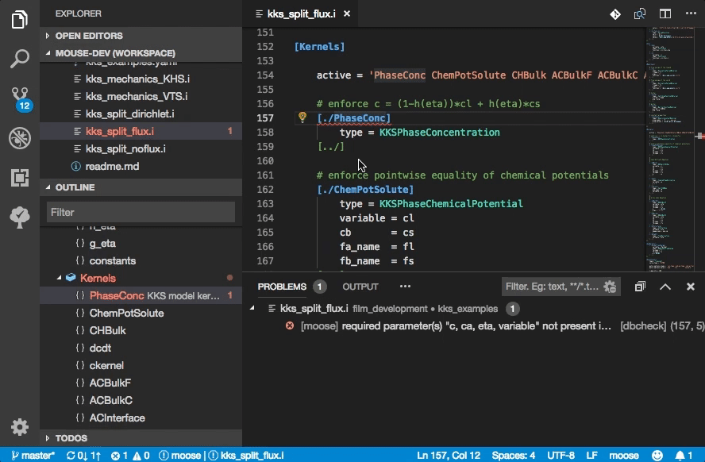
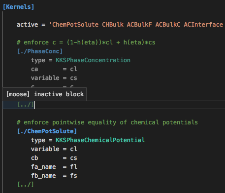
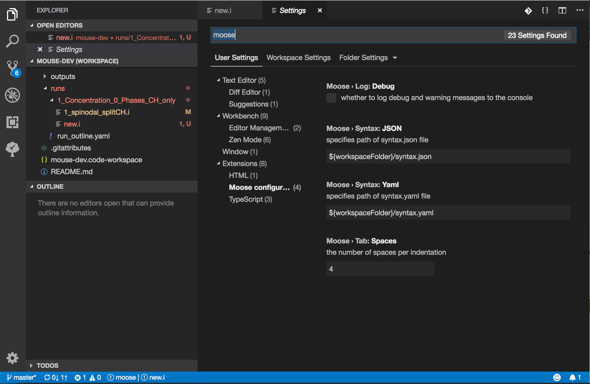

# VSCode for MOOSE

This extension provides language support and IntelliSense for input files of MOOSE (Multiphysics Object Oriented Simulation Environment) applications.

**Note**: A major API change occurred in v0.7.0

## Features

- Syntax Highlighting
- [Autocompletion](#auto-completion)
- Code-Folding
- Outline Tree
- Hover Definitions
- [File Diagnostics and Fixes](#file-diagnostics)
- [Format Document](#auto-formatting)
- Peek/GoTo Referenced Variable/Material Definitions
- Find All References of Variables/Functions/Materials
- Peek/GoTo C++ Source Files

### Auto Completion Demo

### Introspection Demo

## Loading MOOSE Syntax Data

MOOSE object and hierarchy data is read primarily from the YAML file you can create from your MOOSE application:

    >> ./moose-opt --yaml > syntax.yaml

Additional data (descriptions and source file paths) will also be read, if available, from the JSON output:

    >> ./moose-opt --json > syntax.json

These can also be created within VS Code *via* selecting '`MOOSE: Create Syntax Files`' in the Command Palette (`Cmnd+Shift+P`), or downloading example files from the [Extension Repository](https://github.com/chrisjsewell/vscode-moose/tree/master/src/test).

By default, these files are expected to be in the top-level of the workspace, but their paths can be altered in the [Settings](#settings).

## Auto-Completion

Autocompletion is triggered either by `Ctrl+Space` or typing `[` or `=`.

## File Diagnostics

Files are diagnosed for multiple types of syntax and formatting errors:

- `closure`: if block(s) have not been closed,
- `duplication`: duplication of block or parameter names,
- `refcheck`: internal variable reference checks
- `matcheck`: internal material reference checks
- `dbcheck`: checks against the syntax database (e.g. block or parameter not found and required parameters missing)
- `format`: formatting warnings, including bad indentation and multiple blank lines

Some of these errors can be fixed by [Code Actions](https://code.visualstudio.com/docs/editor/refactoring#_code-actions-quick-fixes-and-refactorings):

Additionally, blocks which have been set as inactive (by the `active` or `inactive` parameters) will be rendered faded out:

The amount of fading is controlled by the `editorUnnecessaryCode.opacity` theme colour or can be underlined using `editorUnnecessaryCode.border`.

Diagnostics types can be turned on/off in the [Settings](#settings).

## Auto-Formatting

Selecting the `Format Document` option will format the document by:

- Indenting the sections according to their level (the number of space per indentation can be controlled in the [Settings](#settings)).
- Removing multiple blank lines.

Format as you type can also be set in the [general settings](https://code.visualstudio.com/docs/getstarted/settings) (`editor.formatOnType: true`).

## Settings

Settings are configured in `Preferences -> Settings`:

| Name                        | Description                                              |
| --------------------------- | ---------------------------------------------------------|
| `moose.syntax.yaml`         | the path of the YAML file                                |
| `moose.syntax.json`         | the path of the JSON file                                |
| `moose.tab.space`           | the number of spaces per indentation                     |
| `moose.diagnostics.error`   | specify which syntax error types are flagged as errors   |
| `moose.diagnostics.warning` | specify which syntax error types are flagged as warnings |
| `moose.log.debug`           | log debug and warning messages to the console            |

## Commands

Accessed with `Cmnd+Shift+P`:

- `MOOSE: Reset MOOSE Objects Database`
- `MOOSE: Create Syntax Files`

## How to install from Marketplace

This extension is hosted at Visual Studio Marketplace

1. Upgrade to Visual Studio Code 1.15.0 or above.
2. Switch to the Extensions view by clicking the fifth icon in the left most bar.
3. Type “moose” in the search box and hit the Enter key.
4. Click “Install” button to install “MOOSE for VSCode” extension.

## Release Notes

### 0.7.0

Major API change (using syntax.yaml)

### 0.7.1

Fixed some bugs:

- ignore commented out blocks
- include active/inactive parameters at block level
- underline TODO comments

### 0.8.0

- added variables and materials names to autocompletion and hover functionality
- added variable / material definition locations to DefinitionProvider
- added `cpp_type` to description in HoverProvider
- fixed bug when parameter is defined before any blocks
- fixed bug when parameters are defined in GlobalParams block

### 0.8.1

- added autocompletion for values of active/inactive parameters

### 0.8.2

- added identification and fading of inactive blocks

### 0.9.0

- added error checking for missing required parameters
- classified errors by type and allowed control of their reporting *via* settings
- added CodeActions to provide errors corrections
- fixed bug whereby assessing outline/errors would show for wrong document
- general code refactoring

### 0.9.1

- added reference provider functionality

### 0.9.2

- improved identification of variable/material definitions and references

### 0.9.3

- added diagnostics of internal variable/material references
- split diagnostics user option to set which error types are flagged as errors or warnings

## Acknowledgements

Thanks to Daniel Schwen for supplying code for [MOOSE autocompletion in ATOM.io](https://github.com/dschwen/autocomplete-moose)

## VS Code Extension Development

Some useful links:

- [Node.js in VS Code](https://code.visualstudio.com/docs/nodejs/nodejs-tutorial)
- [Extension API](https://code.visualstudio.com/api)
- [Variables Reference](https://code.visualstudio.com/docs/editor/variables-reference)
- [Azure Pipelines](https://docs.microsoft.com/en-us/azure/devops/pipelines/languages/javascript?view=vsts&tabs=yaml) and [Example Repo](https://github.com/MicrosoftDocs/pipelines-javascript)

To create an extension:

    >>> yo code

To open MOOSE for VSCode extension:

    >>> cd /path/to/extension
    >>> code .

Use F5 to open test environment.

To publish extension:

    >>> vsce publish